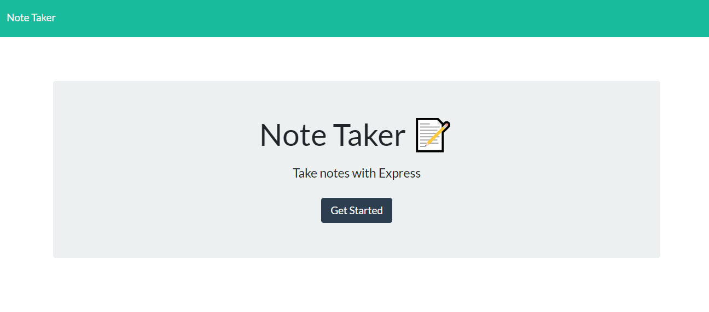
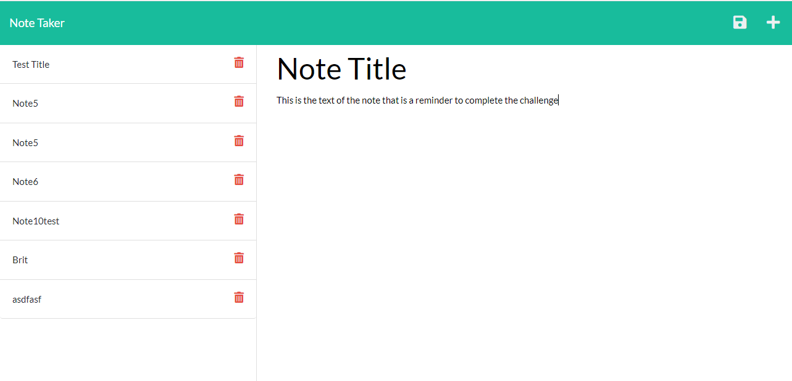

# Note Taker Starter Code

## Project Description

This project allows a user to enter notes and save them using local storage. The user will also see all previous notes when the app
is opened.

## Tools Used to Create This Project

* JavaScript
* RESTful api

## Link to Deployed Application:

You can access the application on Heroku at:

https://notetaker-deploy-brit.herokuapp.com/

# Future Work

* I would like to add more context to the notes information
    * Categories to save notes

# Screenshots of the Application

